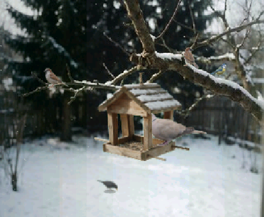
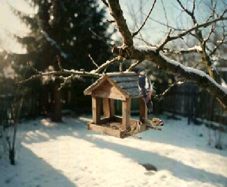
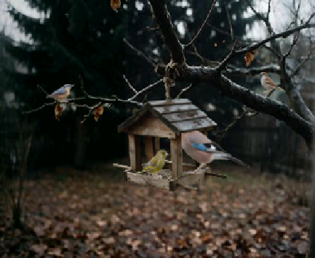
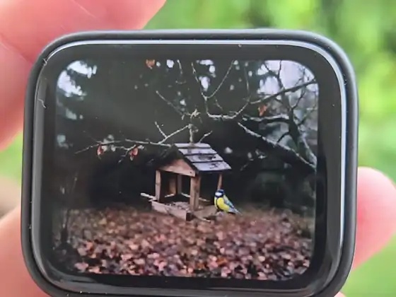

# Bird Feeder

A window onto a garden bird feeder, for the **Waveshare ESP32-S3-Touch-AMOLED-1.8**
(V2). Birds come, peck, squabble and leave; the feeder swings under them and in
the wind; the branch it hangs from sways; the light follows the time of day; leaves
fall in autumn and snow in winter. Nothing to operate: a tap on the glass scares
the birds off, and they come back one by one.

| Winter, overcast | Winter morning | Autumn |
|---|---|---|
|  |  |  |



On the board, autumn, a blue tit on the tray. The three pictures above are
frames grabbed from the scene itself; this one is ten seconds of it running,
filmed off the panel. A [still](docs/on-the-board.jpg) of the same moment and
the [whole clip](docs/on-the-board.mp4) are here too.

## What happens on the screen

- **Eleven visitors**, each with its own habits: house sparrows in flocks,
  great and blue tits, greenfinches, goldfinches, a nuthatch head-down on the
  trunk, a blackbird scratching on the ground far behind, a collared dove that
  misjudges its landing and sets the feeder swinging, and rarely a great spotted
  woodpecker, a jay or a red squirrel.
- **Birds as small state machines**: arrive, sit, peck, look back, hop to another
  place, leave. Personalities are drawn per bird (nervous, steady, quarrelsome);
  big birds push small ones off the tray; a sparrow shoves its neighbour.
- **Physics you can see**: the feeder is a damped pendulum pushed by every
  landing in proportion to the bird's weight, and by the wind. The branch bends
  with the same wind, tip most, fork not at all.
- **Depth**: bird sizes come from a depth map of the photo, so the blackbird on
  the ground metres behind is small and slightly out of focus; birds inside the
  feeder pass behind its roof and front posts; leaves and snow falling in the
  distance pass behind the branch.
- **Light and time**: warm mornings, flat noon, golden evenings, and a dark
  night with nobody about, from the real-time clock. Clouds drift across as a
  slow wave of light; on the sunny morning a brighter band wanders.
- **A new garden every start**: the season picks the background (two winter
  photos, one autumn), and coins decide the snow, the wind, the size of the
  sparrow flock, whether greenfinches come and which rare guest may appear.

Runs at 18–23 fps: a 320×240 scene drawn in bands on both cores and stretched to
the panel's 448×368 landscape.

## Hardware

- [Waveshare ESP32-S3-Touch-AMOLED-1.8](https://www.waveshare.com/esp32-s3-touch-amoled-1.8.htm),
  **V2** (CO5300 panel, CST820 touch). The original revision with the SH8601
  panel and FT3168 touch is not supported.
- Hold it in landscape with the USB connector at the top.
- A battery is optional. On USB the screen goes dark after three hours without a
  touch, on battery after ten minutes.

## Build and flash

With [PlatformIO](https://platformio.org/):

```
pio run -t upload
```

or with ESP-IDF 5.5:

```
idf.py set-target esp32s3
idf.py build flash
```

The first build fetches `espressif/esp_lcd_co5300` through the component manager.

## First start

The board keeps local time in its RTC. To set it from the internet, open the USB
serial port (115200 baud, any terminal, `pio device monitor` works) and type:

```
WIFI <network name> <password>
TZ CET-1CEST,M3.5.0,M10.5.0/3
```

The time zone is a [POSIX TZ string](https://www.gnu.org/software/libc/manual/html_node/TZ-Variable.html);
Central European time is the default, `UTC0` is plain UTC. Both are stored on the
board. The radio only comes on to ask the time, at start and every twelve hours,
and goes off again. Without a network the RTC runs on its own, seeded with the
build time the first time it starts.

## Using it

- **Tap** the glass: the birds fly off. On a dark screen a tap wakes it.
- **PWR, short press**: screen off and on. Held for six seconds the power chip
  switches the board off.

Console commands (USB serial):

| Command | |
|---|---|
| `WIFI <ssid> <password>`, `WIFI?` | store a network and sync the clock; show its state |
| `TZ <posix tz>`, `TZ?`, `SYNC`, `TIME` | time zone, sync now, show the RTC |
| `BRIGHTNESS <0-100>` | panel brightness, stored |
| `SCREEN ON`, `SCREEN OFF` | |
| `HOUR <0-24>`, `CLOCK` | hold the scene at an hour; back to the RTC |
| `VISIT <species>` | call a visit: `vrabec` `konadra` `modrinka` `zvonek` `stehlik` `brhlik` `kos` `hrdlicka` `strakapoud` `sojka` `veverka` |
| `TAP`, `LEAF`, `NEARLEAF`, `FLURRY` | a tap, a falling leaf, a leaf close in front, a far snow flurry |

The species names are Czech, as in the code: sparrow, great tit, blue tit,
greenfinch, goldfinch, nuthatch, blackbird, collared dove, great spotted
woodpecker, jay, red squirrel.

## How it is made

| | |
|---|---|
| `main/app_main.cpp` | the loop: drawing on both cores, touch, PWR key, clock, dark screen |
| `main/board_*.c` | I2C, CO5300 panel over QSPI, CST820 touch, AXP2101 power chip, PCF85063A RTC |
| `main/net_time.c`, `main/console.c` | Wi-Fi time sync, USB console |
| `main/scene/world.cpp` | the birds, the pendulum, wind and branch, visits and startles |
| `main/scene/draw.cpp` | layers back to front: photo, ground birds, feeder, birds inside, roof and posts again, birds outside, snow |
| `main/scene/sky.cpp` | time-of-day light, clouds, the sun band, the branch bending in the photo |
| `main/scene/fall.cpp`, `snow.cpp` | falling leaves, far flurries, snow in front |
| `main/scene/*_art.cpp`, `feeder_bg.cpp` | baked pictures, generated by the tools below |
| `main/engine/` | the renderer from Aquarium_Espresso: RGB565 bands, anti-aliased shapes, stretch |

### Tools

On a computer, with any g++ (MSYS2 on Windows) and Python 3 with numpy, Pillow
and scipy. The exact commands are in each file's header.

- `tools/sheet_cut.py` cuts the bird sheets in `art/` into sprites with alpha and
  bakes them into `main/scene/bird_art.cpp`.
- `tools/make_assets.py art` bakes the backgrounds, the feeder (one per
  background, with its own roof and front posts), the places birds sit, the
  branch mask and the depth-based sizes; `--overlay` draws the places over the
  scene for checking. Coordinates are in `tools/feeder.json`.
- `tools/preview.cpp` runs the scene for a while and writes one frame as a PNG.
- `tools/video.cpp` writes every frame for ffmpeg; the scripts of the sample
  videos are in its header.

## Credits and licence

Code: MIT, see [LICENSE](LICENSE). The rendering engine comes from
**Aquarium_Espresso** by mochimochi-man (MIT). The artwork was generated with
Magnific and is not under the MIT licence. Details in
[THIRD_PARTY_NOTICES.md](THIRD_PARTY_NOTICES.md).
